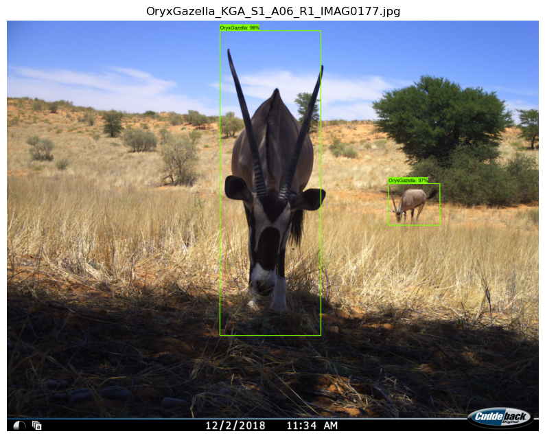
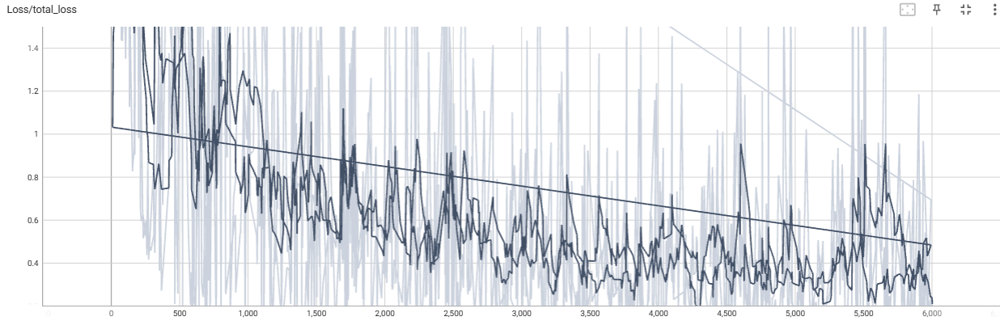

# Wildlife Detection with Faster R-CNN

A three-class camera-trap wildlife detector for **oryx (*Oryx gazella*)**, **lion (*Panthera leo*)** and **warthog (*Phacochoerus africanus*)**. It fine-tunes a COCO-pretrained **Faster R-CNN ResNet-101 (1024×1024)** with the **TensorFlow 2 Object Detection API** on 1,500 annotated images (500 per class), selected from a pool of 6,336 raw images. After 6,000 training steps the model reaches **mAP@0.50 = 0.8926** and **mAP@0.75 = 0.7016** on the evaluation split. After warm-up, inference takes **about 0.06 s per image** (0.053–0.074 s across 18 timed runs). The work is split into five Jupyter notebooks: data analysis, training, evaluation, TensorBoard analysis and qualitative inference on 9 unseen test images.

<p align="center">
  
  
</p>
<p align="center"><em>Left: detections on an unseen oryx image, score threshold 0.75 (notebook 05). Right: TensorBoard total loss over 6,000 steps (notebook 04).</em></p>

---

## Results

### Detection accuracy (COCO-style box metrics, step 6,000)

| Metric | Value |
|---|---:|
| `DetectionBoxes_Precision/mAP@.50IOU` | **0.8926** |
| `DetectionBoxes_Precision/mAP@.75IOU` | **0.7016** |

> These values come from TensorBoard scalar screenshots in `04 Tensorboard.ipynb`, not from printed cell output. Evaluation was logged at the final checkpoint (step 6,000) only. Per-class AP was not recorded.

### Inference speed (printed output, `05 Inference.ipynb`)

| | Run 1 | Run 2 |
|---|---:|---:|
| SavedModel load time | 65.93 s | 10.83 s |
| Per-image inference, range | 0.061–0.067 s | 0.053–0.074 s |
| Per-image inference, mean of 9 | 0.064 s | 0.063 s |

The first load is a cold start. The notebook then runs the same code a second time, and that run gives the second column. Both runs start with a warm-up pass on a 1024×1024 zero tensor before any image is timed.

### Qualitative test images (score threshold 0.75)

| Test image | True species | Time run 1 (s) | Time run 2 (s) | Author's visual assessment |
|---|---|---:|---:|---|
| `OryxGazella_KAR_S1_E02_R1_IMAG2530` | Oryx | 0.061 | 0.059 | Success: small oryx in a wide landscape |
| `OryxGazella_KAR_S1_E03_R1_IMAG0048` | Oryx | 0.067 | 0.053 | Fail: close-up, truncated animal not detected |
| `OryxGazella_KGA_S1_A06_R1_IMAG0177` | Oryx | 0.067 | 0.061 | Success: two oryx detected |
| `PantheraLeo4835` | Lion | 0.066 | 0.074 | Success |
| `PantheraLeo4883` | Lion | 0.066 | 0.066 | Success: walking pose |
| `PantheraLeo4895` | Lion | 0.065 | 0.059 | Success: side-on, in motion |
| `PhacochoerusAfricanus_LMA1_19NR12__20201216__162415` | Warthog | 0.061 | 0.062 | Partial: background warthog missed |
| `PhacochoerusAfricanus_LMA1_19NR12__20201218__174153` | Warthog | 0.063 | 0.067 | Failure: labelled as lion, plus a duplicate box |
| `PhacochoerusAfricanus_LMA1_22NR36__20201221__090223_1` | Warthog | 0.062 | 0.065 | Success |

Times are the printed values. The assessments are the author's visual judgements of the rendered detections. Detection confidence scores were not printed, so they are omitted here.

---

## Dataset

| Property | Value (printed output, `01 Data Analysis.ipynb`) |
|---|---|
| Raw images in `images/` | 6,336 |
| Pascal VOC XML annotations | 1,500 |
| Files in clean annotated subset (image + XML) | 3,000, i.e. 1,500 pairs |
| Classes | 3 (500 annotated images each, counted from the filenames printed in notebook 02) |
| Train / test split | 90 / 10 (`partition_dataset.py -r 0.1`) |

**Image resolution over all raw images.** Notebook 01 labels `img.shape[0]` as width, but it is actually height. The table gives the corrected axes:

| | Mean | Min | Max |
|---|---:|---:|---:|
| Height (px) | 1448.1 | 332 | 4000 |
| Width (px) | 1944.1 | 405 | 5184 |

**Sources**

- **Oryx:** all 500 training images come from **Snapshot Camdeboo** (`CDB`). The oryx test images come from **Snapshot Karoo** (`KAR`) and **Snapshot Kgalagadi** (`KGA`). Karoo and Kgalagadi are not in the training set, so these test images come from new sites. All three are part of the Snapshot Safari project and can be downloaded from LILA BC:
  - Snapshot Camdeboo: <https://lila.science/datasets/snapshot-camdeboo>
  - Snapshot Karoo: <https://lila.science/datasets/snapshot-karoo/>
  - Snapshot Kgalagadi: <https://lila.science/datasets/snapshot-kgalagadi>
- **Lion** (`PantheraLeo###.jpg`) and **warthog** (`PhacochoerusAfricanus_LMA1_…`, `…_IMG_…`, `…_RCNX…`): the source is not recorded in the notebooks.

The raw dataset, annotations, TFRecords and trained checkpoints are **not included** in this repository. Only the 9 test images are included.

---

## Pipeline

| Notebook | Stage | What it does |
|---|---|---|
| [`01 Data Analysis.ipynb`](notebooks/01%20Data%20Analysis.ipynb) | EDA and validation | Plots the image-resolution scatter and histograms and prints summary statistics. Counts images vs. XMLs and copies the annotated pairs into `annotated_images/`. |
| [`02 Model Training.ipynb`](notebooks/02%20Model%20Training.ipynb) | Training | Strips whitespace from XML `filename`/`name` fields and runs `xmlconversion.py`. Makes the 90/10 split, generates `train.record`/`test.record` from `label_map.pbtxt`, trains Faster R-CNN ResNet-101 for 6,000 steps with `model_main_tf2.py` and exports a SavedModel with `exporter_main_v2.py`. |
| [`03 Evaluation Scripts.ipynb`](notebooks/03%20Evaluation%20Scripts.ipynb) | Evaluation | Runs `model_main_tf2.py` in eval-only mode (`--checkpoint_dir`, `--eval_timeout=600`) and checks that eval event files were written (8 found). |
| [`04 Tensorboard.ipynb`](notebooks/04%20Tensorboard.ipynb) | Convergence analysis | Launches TensorBoard and discusses the total, classification and localisation loss, the learning-rate schedule and mAP at IoU 0.50 and 0.75. |
| [`05 Inference.ipynb`](notebooks/05%20Inference.ipynb) | Inference | Loads the SavedModel and warms it up. Runs detection on `test_images/`, draws boxes with a score threshold of 0.75 and prints per-image timings. |

---

## Repository structure

```
wildlife-detection-faster-rcnn/
├── README.md
├── .gitignore
├── assets/
│   ├── detection_oryx_multi_instance.png   # extracted from notebook 05
│   └── total_loss_tensorboard.png          # extracted from notebook 04
└── notebooks/
    ├── 01 Data Analysis.ipynb
    ├── 02 Model Training.ipynb
    ├── 03 Evaluation Scripts.ipynb
    ├── 04 Tensorboard.ipynb
    ├── 05 Inference.ipynb
    └── test_images/                         # 9 unseen JPGs, 3 per species
```

The notebooks use relative paths and expect this **local, untracked** layout inside `notebooks/`:

```
notebooks/
├── images/                     # raw images + Pascal VOC XMLs
├── annotated_images/{train,test}/
├── data/
│   ├── label_map.pbtxt
│   ├── train.record
│   └── test.record
├── training/TF2/training/faster_rcnn_resnet101_v1_1024x1024_coco17_tpu-8/
│   ├── pipeline.config
│   ├── ckpt-*                  # training checkpoints
│   ├── eval/                   # evaluation event files
│   └── saved_model/saved_model/
├── xmlconversion.py
├── partition_dataset.py
├── generate_tfrecord.py
├── model_main_tf2.py
└── exporter_main_v2.py
```

---

## Setup and requirements

**Original environment:** Windows, Python 3.8.16 (Jupyter `ipykernel`), TensorFlow 2 with the TensorFlow Object Detection API, and TensorBoard. The notebooks enable GPU memory growth, and the ~0.06 s inference times suggest the model ran on a GPU. The GPU model and the package versions were not recorded.

1. Create an environment:
   ```bash
   conda create -n wildlife-od python=3.8 -y
   conda activate wildlife-od
   ```
2. Install the TensorFlow 2 Object Detection API ([official guide](https://github.com/tensorflow/models/blob/master/research/object_detection/g3doc/tf2.md)). You need `protoc` on your `PATH`.
   ```bash
   git clone https://github.com/tensorflow/models.git
   cd models/research
   protoc object_detection/protos/*.proto --python_out=.
   cp object_detection/packages/tf2/setup.py .     # Windows: copy object_detection\packages\tf2\setup.py .
   python -m pip install .
   ```
3. Install the notebook dependencies:
   ```bash
   pip install jupyter matplotlib numpy pillow tensorboard
   ```
4. Copy `model_main_tf2.py` and `exporter_main_v2.py` from `models/research/object_detection/` into `notebooks/`. `partition_dataset.py` and `generate_tfrecord.py` are available from the [TensorFlow 2 Object Detection API tutorial](https://tensorflow-object-detection-api-tutorial.readthedocs.io/). `xmlconversion.py` is not included in this repository.
5. Download the pretrained checkpoint `faster_rcnn_resnet101_v1_1024x1024_coco17_tpu-8` from the [TF2 Detection Model Zoo](https://github.com/tensorflow/models/blob/master/research/object_detection/g3doc/tf2_detection_zoo.md) and extract it to `notebooks/training/TF2/training/`.

## How to run

Start Jupyter from inside `notebooks/`, because every path in the notebooks is relative to that folder.

1. **Prepare the data.** Put the images and their XML files in `notebooks/images/`, then run `01 Data Analysis.ipynb`.
2. **Create a label map** at `data/label_map.pbtxt` with three items (ids 1–3). The `name` values must exactly match the `<name>` tags in your XML files.
3. **Edit `pipeline.config`.** The settings that usually need changing are `num_classes: 3`, `fine_tune_checkpoint` (pointing to the downloaded `ckpt-0`), `fine_tune_checkpoint_type: "detection"`, `label_map_path`, and the `input_path` of the train and eval readers (`data/train.record`, `data/test.record`).
4. Run `02 Model Training.ipynb` to split the data, build the TFRecords, train for 6,000 steps and export the model.
5. Run `03 Evaluation Scripts.ipynb` to write eval metrics, then `04 Tensorboard.ipynb`, or run `tensorboard --logdir=training/TF2/training` in a terminal.
6. Run `05 Inference.ipynb` to detect animals in `test_images/`.

---

## Known issues and limitations

- **Not reproducible from this repository alone.** The dataset, `label_map.pbtxt`, `pipeline.config`, the helper scripts and the trained model are not included. The exact training hyperparameters (batch size, learning-rate schedule, augmentation) are therefore not documented.
- **Width and height are swapped in notebook 01.** `d1, d2, color = img.shape` stores height in `dim1`, but the plots and print statements label it as width.
- **The saved cells show interrupted runs.** The training, export, evaluation and `tensorboard` cells all show `^C` as their output. The exported model and the 8 eval event files exist, so these steps did complete at some point, but their logs are not saved in the notebooks.
- **The evaluation is thin.** It uses a single random 90/10 split with no separate validation set. mAP is logged only at step 6,000, there is no per-class AP, and the values were read from screenshots.
- **The data sources may bias the model.** All training oryx come from one Snapshot Safari site, and lions and warthogs come from different collections. The model may be learning camera or background cues as well as the animals themselves.
- **Small qualitative test.** Only 9 images were tested. The failures seen were a truncated close-up, a small background animal and a warthog labelled as a lion.
- **Only annotated images are used.** 4,836 of the 6,336 raw images have no annotation and are not used.
- **`05 Inference.ipynb` runs twice and is large (29 MB).** Its cell repeats the entire load-and-infer block, so every output appears twice.
- **`xmlconversion.py` calls `rsync`,** which is not available on Windows, so the notebook shows an error for that step.
- Notebook 02 uses `!code` to open files, which needs the VS Code CLI.

---

## References

1. Ren, S., He, K., Girshick, R. and Sun, J. (2015). *Faster R-CNN: Towards Real-Time Object Detection with Region Proposal Networks.* NeurIPS. [arXiv:1506.01497](https://arxiv.org/abs/1506.01497)
2. He, K., Zhang, X., Ren, S. and Sun, J. (2016). *Deep Residual Learning for Image Recognition.* CVPR. [arXiv:1512.03385](https://arxiv.org/abs/1512.03385)
3. Lin, T.-Y. et al. (2014). *Microsoft COCO: Common Objects in Context.* ECCV. [arXiv:1405.0312](https://arxiv.org/abs/1405.0312)
4. Huang, J. et al. (2017). *Speed/Accuracy Trade-offs for Modern Convolutional Object Detectors.* CVPR. [arXiv:1611.10012](https://arxiv.org/abs/1611.10012)
5. Pardo, L. E. et al. (2021). *Snapshot Safari: A large-scale collaborative to monitor Africa's remarkable biodiversity.* South African Journal of Science, 117(1/2).
6. TensorFlow Object Detection API: <https://github.com/tensorflow/models/tree/master/research/object_detection>
7. TensorFlow 2 Detection Model Zoo: <https://github.com/tensorflow/models/blob/master/research/object_detection/g3doc/tf2_detection_zoo.md>
8. TensorFlow 2 Object Detection API tutorial: <https://tensorflow-object-detection-api-tutorial.readthedocs.io/>
9. LILA BC camera-trap datasets: <https://lila.science/datasets/>
